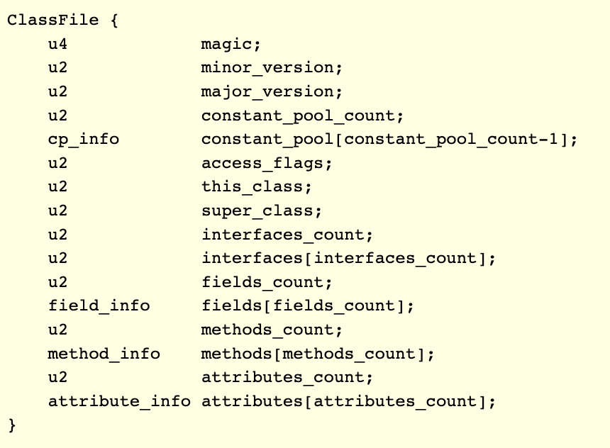

### ASM是什么？
1. ASM就是Java提供用来操作字节码的类库
#### ASM操作对象是什么？
1. 字节码数据， ByteCode。通常使用.class文件，也可以是其它的表现形式
#### ASM如何处理字节码ByteCode数据？
1. 拆分、修改、合并
    1. 将.class文件拆分成多个部分
    2. 对其中的某个部分修改
    3. 将修改后的多个部分组装成为一个.class文件

### ASM的过去和现在
1. ASM的过去
2. ASM的现在
3. ASM的版本发展

### ASM能做什么
1. 通俗的理解
    1. 父类：修改一个类的继承的父类
    2. 接口：添加/删除一个类实现的接口
    3. 字段：添加/删除一个类中的字段
    4. 方法：添加/修改/删除一个类中的方法
2. 专业的描述
    1. manipulation
        1. generation
        2. transformation
    2. analysis

### 为什么要学习ASM
1. Spring中的ASM
    1. Spring AOP
2. JDK中的ASM
    1. Lambda
        1. 使用javap -v -p Class查看反编译的信息

### ASM的两个组成部分
1. Core API
    1. asm.jar
        1. ClassVisitor 重点
            1. 负责对.class的某个部分进行修改
        2. ClassWriter 重点
            1. 负责将不同的部分进行组合成一个完整的.class文件
        3. FieldVisitor
        4. FieldWriter
        5. MethodVisitor
        6. MethodWriter
        7. Label
        8. Opcodes
        9. ClassReader 重点
            1. 负责读取.class文件并拆分成各个不同的部分
        10. Type
    2. asm-util.jar
        1. Check 负责检查.class文件是否正确
            1. CheckClassAdapter
        2. Trace 负责将.class文件的内容打印成文字可以探索或追踪内部信息
            1. TraceClassVisitor
        3. Printer
        4. ASMifier
        5. Textifier
    3. asm-commons.jar
        1. AdviceAdaptor
        2. AnalyzerAdaptor
        3. ClassRemapper
        4. GeneratorAdaptor
        5. InstructionAdaptor
        6. LocalVariableSorter
        7. SerialVersionUIDAdaptor
        8. StaticInitMerger
2. Tree API
    1. asm-tree.jar
    2. asm-analysis.jar
3. 两者之间的关系Core API是基础，Tree API是基于Core API构建起来的

### ASM与ClassFile的区别
1. ClassFile
    1. 常见的字节码类库
       1. Apache Commons BCEL(Byte Code Engineering Library)
       2. Javassist(Java programming assistant)
       3. ObjectWeb ASM
       4. Byte Buddy
2. ASM fast small
3. ASM与ClassFile的关系
4. ClassFile结构

   1. u1 u2 u4 u8 占用字节数
   2. cp_info(constant_pool常量池) field_info() method_info attribute_info 表示复杂的结构也是由u1 u2 u4 u8x组成的
   3. 